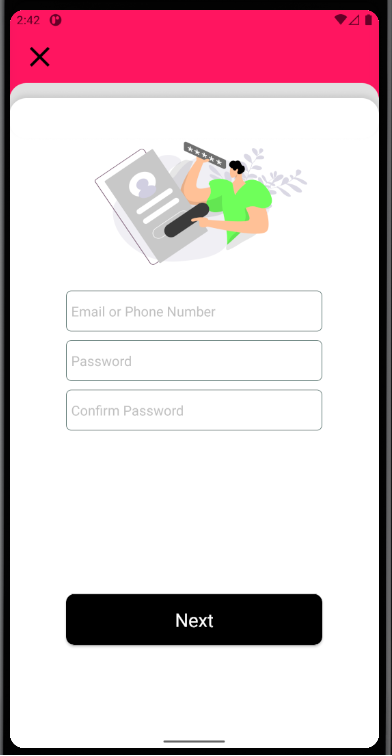
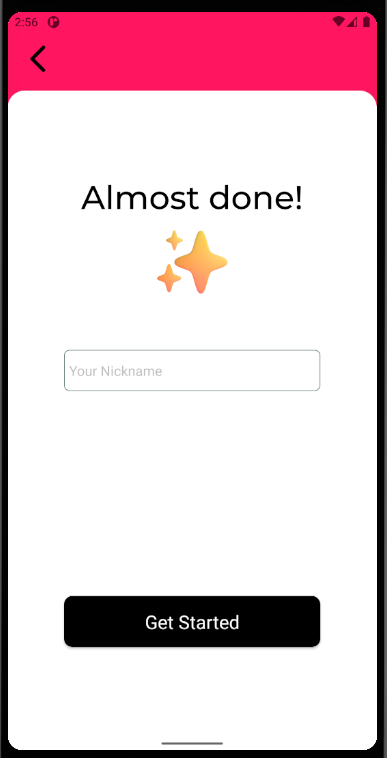
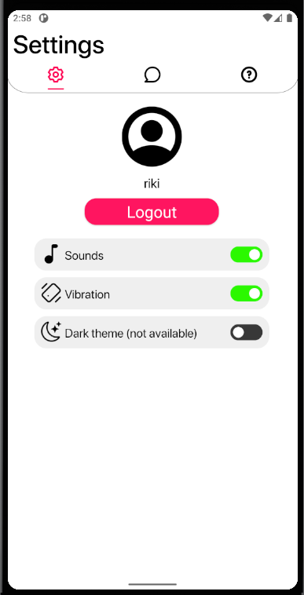
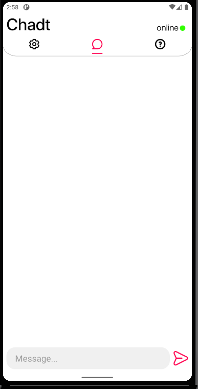
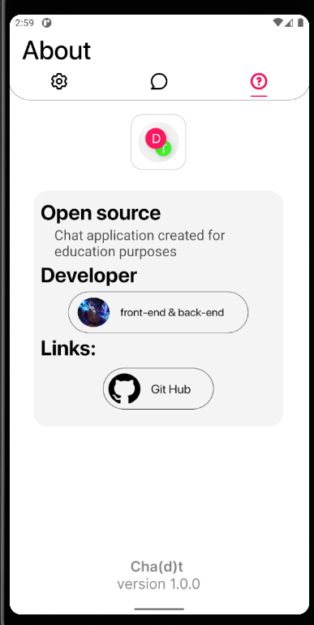

### Android messanger with global chat based on TCP/IP sockets
### UX Designer - https://github.com/commonPlaceC
#### Server Code - https://github.com/CpedniyNikon/TcpServer

    
    
    
    
    
    

https://www.youtube.com/watch?v=AWJInZSH1Gw
